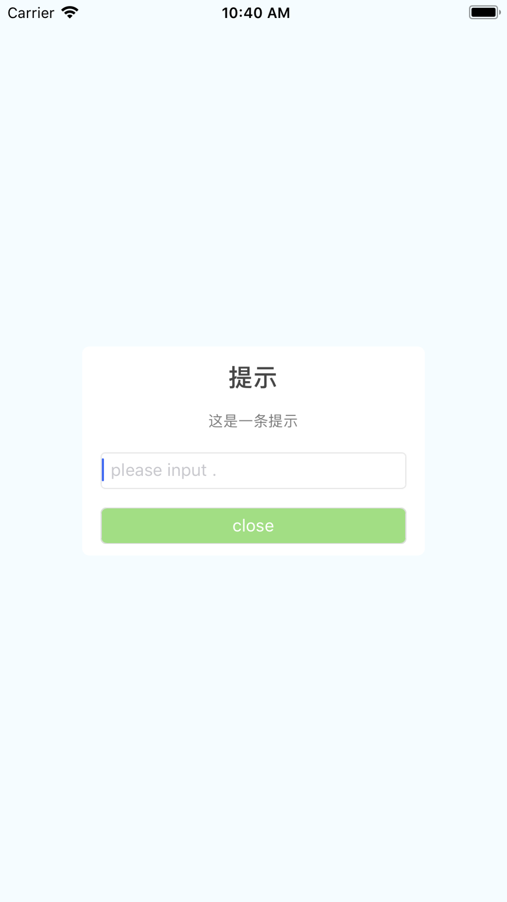

# react-native-sf-modal

# 提示信息,消息




# 安装
> npm install react-native-sf-modal
> npm install andt-mobile --save

# Props
|  parameter  |  type  |  required  |   description  |  default  |
|:-----|:-----|:-----|:-----|:-----|
|title|string|yes|标题|null|
|info|string|yes|内容|null|
|type|string|no|3种默认主题或自定义|
|cancelText|string|no|取消按钮文字|null|
|okText|string|no|确认按钮文字|null|
|cancelCallback|func|no|取消回调|null|
|okCallback|func|no|确认回调|null|
|bottom|component|no|自定义底部栏|null|
|icon|number|no|自定义图片路径|null|
|iconWidth|number|no|图片宽|null|
|iconHeight|number|no|图片高|null|

# 例子
```
/**
 * Sample React Native App
 * https://github.com/facebook/react-native
 * @flow
 */

import React, {Component} from 'react';
import {
    StyleSheet,
    Text,
    View
} from 'react-native';
import SFModal from 'react-native-sf-modal';

export default class App extends Component {
    render() {
        return (
            <View
                style={styles.container}>
                <Text
                    style={styles.welcome}
                    onPress={() => {
                        this.modal.setVisible(true);
                    }}>
                    Welcome to React
                    Native!
                </Text>
                <Text
                    style={styles.instructions}>
                    To get started, edit
                    App.js
                </Text>

                <SFModal
                    ref={(ref) => this.modal = ref}
                    type={'txt'}
                    title={'提示'}
                    info={'这是一条提示'}
                    cancelText={'取消'}
                    okText={'确定'}
                    cancelCallback={() => {
                        this.modal.setVisible(false);
                    }}
                    okCallback={() => {

                    }}/>
            </View>
        );
    }
}

const styles = StyleSheet.create({
    container: {
        flex: 1,
        justifyContent: 'center',
        alignItems: 'center',
        backgroundColor: '#F5FCFF',
    },
    welcome: {
        fontSize: 20,
        textAlign: 'center',
        margin: 10,
    },
    instructions: {
        textAlign: 'center',
        color: '#333333',
        marginBottom: 5,
    },
});


```
